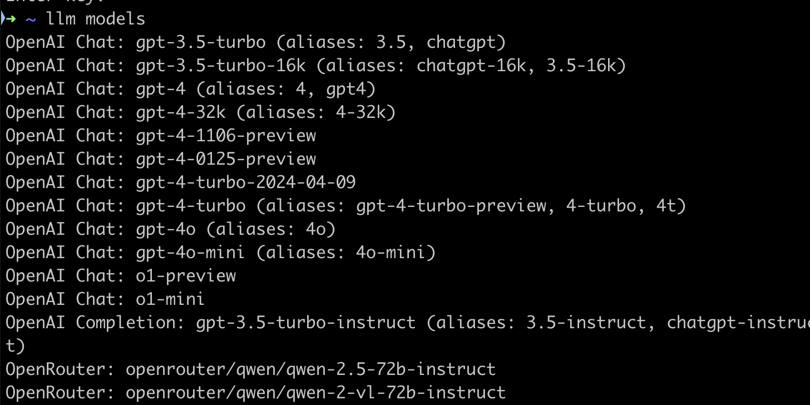

Today, I took a deep dive into setting up the `llm` package on my local machine. This nifty tool allows you to interact with language models directly from your command line. While the process was relatively straightforward, I encountered a few steps worth documenting. Let's walk through the steps I took to get everything up and running smoothly.

## The Setup Process

### 1. Install `pipx`

First things first, we need to install `pipx`. This handy tool lets you install Python packages globally while keeping them isolated in their own environments. It's like having your cake and eating it too – global access without the mess of dependency conflicts. Here's how you can get `pipx` up and running:

```bash
python3 -m pip install --user pipx
python3 -m pipx ensurepath
```

### 2. Install the `llm` package 

With `pipx` at our disposal, installing `llm` is a breeze:

```bash
pipx install llm
```

### 3. Set up the `llm-openrouter plugin`

To tap into the power of Claude 3.5 Sonnet, we need to integrate `llm` with OpenRouter. Here's how:

```bash
llm install llm-openrouter
```

Don't forget to set your OpenRouter API key:

```bash
llm keys set openrouter
```

You can run `llm models` to ensure the new models are accessible.



### 4. Configure an alias for Claude 3.5 Sonnet

To make life easier, let's set up an alias for our favorite AI assistant:

```bash
llm aliases set claude openrouter/anthropic/claude-3.5-sonnet
```

Now you can chat with Claude using this shorthand:

```bash
llm claude "What's the meaning of life, the universe, and everything?"
```

## The Power at Your Fingertips

With this setup, we've essentially turned our terminal into an **AI playground**. We can now effortleslly interact with Claude 3.5 Sonnet (and other models) right from the command line. It's a clean, efficient setup that's perfect for quick experiments or for integrating AI into a workflow.

## Resources

- [LLM on PyPI](https://pypi.org/project/llm/)
- [LLM-OpenRouter on GitHub](https://github.com/simonw/llm-openrouter)
- [OpenRouter Documentation](https://openrouter.ai/docs)
